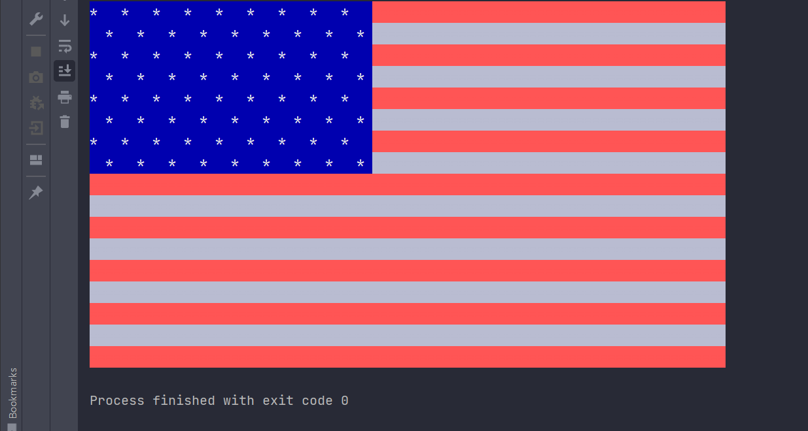

<div align="right">
  
  </a>
</div>

# American Flag - Java
Displays the american flag with colors in the console

# Demo

<div align="center">
  
</div>

You can run the demo on your local machine, please follow the instructions in [Getting Started](#getting-started).

# Technologies

- [JAVA](https://reactjs.org/)

# Getting Started

Follow the instructions below to set up the environment and run this project on your local machine.

1. Clone this repository.

```bash
# Clone repository
$ git clone https://github.com/ViniUK00/american-flag.git
```

2. Install dependencies

```bash
$ JDK 14.0 or later
```

3. Run the server.

```bash
 $ Open the main package and run Main.java class *enjoy !*.
```